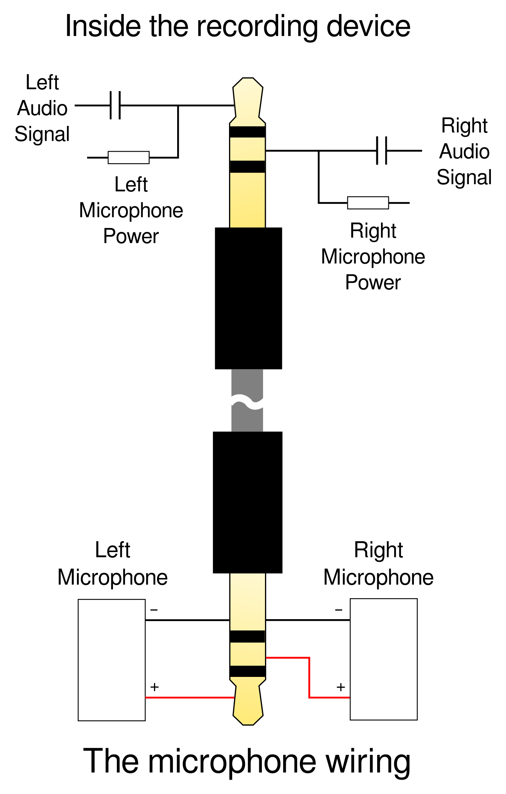
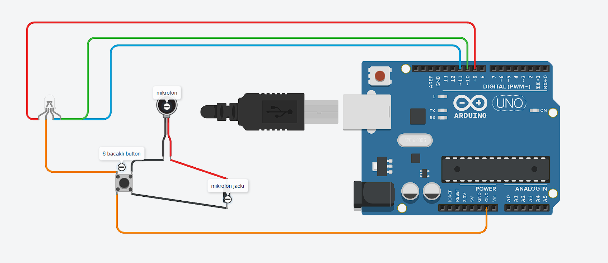
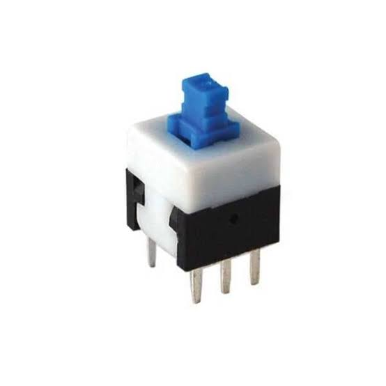

# 🎙️ RGB Mikrofon

Bu proje, standart bir kulaklık mikrofonunu **3.5mm TRS/TRRS Jack** kullanarak **RGB LED** içeren bir mikrofon yapmayı amaçlamaktadır.

Proje iki temel aşamadan oluşmaktadır:

* 🎙️ Mikrofon ve Jack kablolama
* 🔴🟢🔵 Arduino ile RGB LED kontrolü

---

## 🛠️ 1. Mikrofon Kablolama ve Jack Yapısı

Standart elektret mikrofonların çalışabilmesi için düşük seviyeli bir DC besleme gerekir. Bu besleme genellikle **Plug-in Power** olarak adlandırılır.

Mikrofon bağlantısında kullanılan 3.5mm Jack yapısı aşağıdaki gibidir:

<p align="center">
  
</p>

### 🎧 3.5mm TRS Jack Pinleri

| Jack Bölümü | Görevi                       |
| :---------- | :--------------------------- |
| **Tip**     | Sol kanal / Mikrofon sinyali |
| **Ring**    | Sağ kanal / Mikrofon sinyali |
| **Sleeve**  | GND / Şase                   |

Elektret mikrofon kullanırken mikrofonun negatif terminali **GND**, pozitif terminali ise uygun bias/besleme devresi üzerinden sinyal hattına bağlanmalıdır.

> ⚠️ **Not:** TRS ve TRRS Jack bağlantıları aynı değildir. Özellikle telefon kulaklıklarında kullanılan TRRS jaklarda CTIA ve OMTP pin dizilimleri farklı olabilir.

---

## 🔌 2. Arduino Devre Şeması

Arduino tarafında mikrofondan gelen analog sinyal okunabilir ve ses seviyesine göre RGB LED'in rengi veya parlaklığı değiştirilebilir.

Örnek devre:

<p align="center">
  
</p>

### 🔧 Bağlantı Tablosu

| Komponent             | Arduino Pini  | Açıklama                 |
| :-------------------- | :------------ | :----------------------- |
| **RGB LED - Kırmızı** | `D9`          | PWM ile kırmızı kontrolü |
| **RGB LED - Yeşil**   | `D10`         | PWM ile yeşil kontrolü   |
| **RGB LED - Mavi**    | `D11`         | PWM ile mavi kontrolü    |

### ⚠️ RGB LED Dirençleri

RGB LED'in her renk kanalı için ayrı bir akım sınırlama direnci kullanılması önerilir.

Örneğin:

```text
D9  ── 220Ω ── Kırmızı
D10 ── 220Ω ── Yeşil
D11 ── 220Ω ── Mavi
```

RGB LED'in ortak bacağının **Common Anode** veya **Common Cathode** olmasına göre bağlantı ve PWM mantığı değişir.

---

## 💻 3. Arduino Kodu

Aşağıdaki kod RGB LED üzerinde sürekli ve yumuşak bir renk geçişi oluşturur.

```cpp
// Sabitlenen fiziksel bağlantı tanımlamaları
#define LED_MAVI    11  // D11
#define LED_YESIL   10  // D10
#define LED_KIRMIZI 9   // D9

// RGB LED ortak anot ise true,
// ortak katot ise false yapın.
const bool ORTAK_ANOT = true;

void setup() {
  pinMode(LED_KIRMIZI, OUTPUT);
  pinMode(LED_YESIL, OUTPUT);
  pinMode(LED_MAVI, OUTPUT);
}

void loop() {

  // Renk çarkını 0-764 arasında döndürüyoruz.
  // Böylece kırmızı -> yeşil -> mavi -> kırmızı
  // arasında yumuşak geçiş elde edilir.

  for (int derece = 0; derece < 765; derece++) {

    int r, g, b;

    if (derece < 255) {

      // Kırmızıdan yeşile geçiş
      r = 255 - derece;
      g = derece;
      b = 0;

    }
    else if (derece < 510) {

      // Yeşilden maviye geçiş
      r = 0;
      g = 255 - (derece - 255);
      b = derece - 255;

    }
    else {

      // Maviden kırmızıya geçiş
      r = derece - 510;
      g = 0;
      b = 255 - (derece - 510);
    }

    renkYaz(r, g, b);

    delay(3);
  }
}

void renkYaz(int kirmizi, int yesil, int mavi) {

  if (ORTAK_ANOT) {

    // Common Anode RGB LED
    analogWrite(LED_KIRMIZI, 255 - kirmizi);
    analogWrite(LED_YESIL, 255 - yesil);
    analogWrite(LED_MAVI, 255 - mavi);

  }
  else {

    // Common Cathode RGB LED
    analogWrite(LED_KIRMIZI, kirmizi);
    analogWrite(LED_YESIL, yesil);
    analogWrite(LED_MAVI, mavi);
  }
}
```

---
## 6 bacaklı button

<p align="center">
  
</p>

## 🚀 5. Projeyi Çalıştırma

Devreyi hazırladıktan sonra kodu ardinuo'ya yüklemek yeterlidir

## ⚠️ Güvenlik ve Bağlantı Notları

* Elektret mikrofonlar genellikle bias/besleme gerektirir.
* RGB LED kanallarında akım sınırlama direnci kullanın.
* Arduino analog girişine **5V'dan yüksek bir sinyal uygulamayın**.
* TRRS kulaklık jaklarında pin dizilimini kontrol etmeden bağlantı yapmayın.
* Bilgisayar veya telefon mikrofon girişleri ile Arduino analog girişlerinin elektriksel yapıları aynı değildir.

---

## 📜 Lisans

Bu proje açık kaynaklıdır ve geliştirilmeye açıktır.
